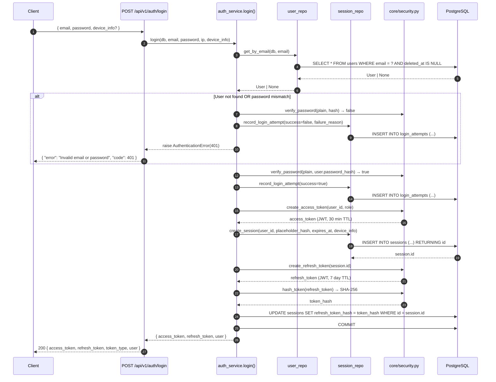
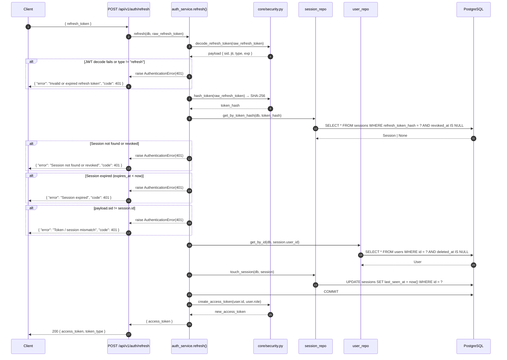
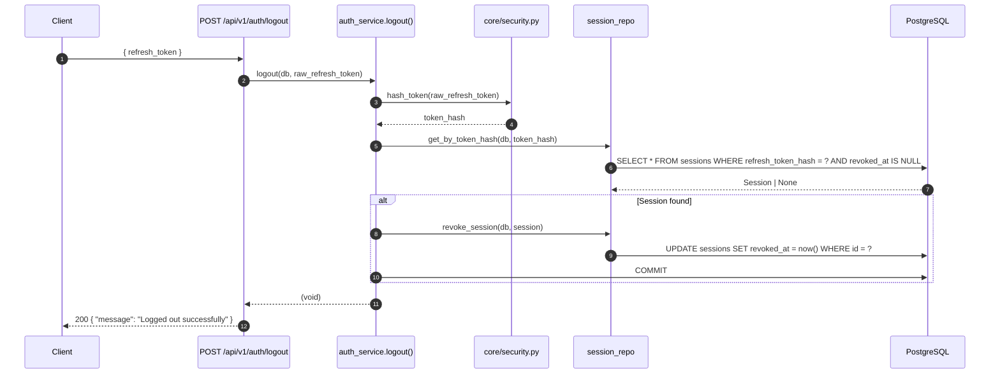
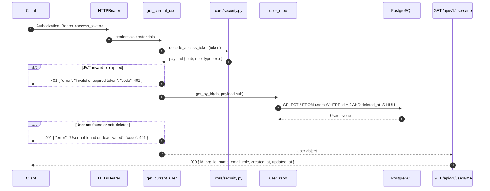

# Authentication & Session Management — Architecture Document

> **Module:** `app/core/security.py`, `app/services/auth_service.py`, `app/api/v1/auth.py`
> **Version:** 1.0 — February 2026
> **Author:** SkyDeck Backend Team

---

## Table of Contents

1. [Overview](#1-overview)
2. [Auth Flow — Sequence Diagram](#2-auth-flow--sequence-diagram)
3. [Token Lifecycle](#3-token-lifecycle)
4. [Session Management](#4-session-management)
5. [Cryptographic Choices](#5-cryptographic-choices)
6. [Data Dictionary](#6-data-dictionary)
7. [Error Codes](#7-error-codes)
8. [Security Considerations](#8-security-considerations)

---

## 1. Overview

SkyDeck uses a **dual-token JWT architecture** with server-side session tracking:

| Concept | Implementation |
|---------|---------------|
| **Access token** | Short-lived JWT (default 30 min). Sent as `Authorization: Bearer <token>`. |
| **Refresh token** | Long-lived JWT (default 7 days). Stored client-side, submitted in the request body. |
| **Session record** | Every login creates a row in `sessions`. The refresh token's SHA-256 hash is stored for revocation lookups. |
| **Login audit** | Every authentication attempt (success or failure) is logged in `login_attempts` with IP, device info, and failure reason. |

The raw refresh token is **never persisted**. Only its SHA-256 digest is stored, so a database leak does not expose live tokens.

---

## 2. Auth Flow — Sequence Diagram

### 2.1 Login



### 2.2 Refresh



### 2.3 Logout



### 2.4 Authenticated Request (GET /me)



---

## 3. Token Lifecycle

### 3.1 Access Token

| Property | Value |
|----------|-------|
| Format | JWT (JWS, compact serialisation) |
| Algorithm | HS256 (HMAC-SHA256) |
| Default TTL | 30 minutes (`ACCESS_TOKEN_EXPIRE_MINUTES`) |
| Payload claims | `sub` (user id), `role`, `type` ("access"), `exp` |
| Transport | `Authorization: Bearer <token>` header |
| Revocation | Not individually revocable; short TTL is the mitigation |

### 3.2 Refresh Token

| Property | Value |
|----------|-------|
| Format | JWT (JWS, compact serialisation) |
| Algorithm | HS256 (HMAC-SHA256) |
| Default TTL | 7 days (`REFRESH_TOKEN_EXPIRE_DAYS`) |
| Payload claims | `sid` (session id), `jti` (random 128-bit hex), `type` ("refresh"), `exp` |
| Transport | JSON request body (`{ "refresh_token": "..." }`) |
| Revocation | Via `sessions.revoked_at` — setting this timestamp invalidates the token |

### 3.3 Why Two Tokens?

The access token is verified **statelessly** (no DB hit) on every request, keeping latency low. The refresh token requires a DB lookup, but is only used infrequently (once every 30 minutes, or when the client detects a 401). This separation gives us:

- **Performance**: Protected endpoints never touch the sessions table.
- **Revocation**: Logging out instantly revokes the refresh token; the access token expires naturally within minutes.
- **Multi-device**: Each device gets its own session row and independent refresh token.

---

## 4. Session Management

### 4.1 Multi-Device Support

Each call to `POST /api/v1/auth/login` creates a **new session row**, even if the same user is already logged in on another device. This means:

- User logs in on an iPad → session A created.
- User logs in on a desktop browser → session B created.
- Logging out on the iPad (revoking session A) does not affect session B.

### 4.2 Session Record Lifecycle

```
LOGIN  →  session created (refresh_token_hash set, expires_at set)
           │
           ├── REFRESH  →  last_seen_at updated (session stays alive)
           │
           ├── REFRESH  →  last_seen_at updated
           │
           └── LOGOUT   →  revoked_at set  →  session is dead
```

### 4.3 Expiry vs Revocation

A session can become invalid in two ways:

1. **Explicit revocation** — `POST /api/v1/auth/logout` sets `revoked_at`.
2. **Natural expiry** — `expires_at` passes. The refresh endpoint checks this.

Both are enforced in `auth_service.refresh()`.

---

## 5. Cryptographic Choices

### 5.1 Password Hashing — bcrypt

| Property | Detail |
|----------|--------|
| Library | `bcrypt==4.2.1` (Python wrapper around OpenBSD bcrypt) |
| Work factor | Default cost factor 12 (2^12 = 4096 iterations of the Blowfish key schedule) |
| Salt | 128-bit random salt, auto-generated by `bcrypt.gensalt()` |
| Output | 60-character Modular Crypt Format string (e.g. `$2b$12$...`) |
| Storage | `users.password_hash` column (`TEXT`) |

**Why bcrypt?**

- Deliberately slow, making brute-force attacks computationally expensive.
- Built-in salt prevents rainbow-table attacks.
- Widely audited and battle-tested in production systems.

### 5.2 Refresh Token Hashing — SHA-256

| Property | Detail |
|----------|--------|
| Library | Python `hashlib.sha256` (stdlib) |
| Input | The full compact JWT string of the refresh token |
| Output | 64-character lowercase hex digest |
| Storage | `sessions.refresh_token_hash` column (`TEXT`, `UNIQUE`) |

**Why SHA-256 (not bcrypt) for tokens?**

Refresh tokens are **high-entropy random strings** (128-bit `jti` + JWT structure), not human-chosen passwords. A fast hash like SHA-256 is sufficient because:

- There is no dictionary to attack — the input space is 2^128.
- The hash only needs to be **collision-resistant** and **pre-image resistant**, both of which SHA-256 provides.
- Using bcrypt here would add ~100ms per token lookup with no security gain.

### 5.3 JWT Signing — HMAC-SHA256 (HS256)

| Property | Detail |
|----------|--------|
| Library | `python-jose[cryptography]==3.3.0` |
| Key | `SECRET_KEY` from `app/core/config.py` (must be a 64-byte random key in production) |
| Algorithm | HS256 — symmetric HMAC using SHA-256 |
| Verification | Same secret key used for signing and verification |

**Production requirement:** Generate the secret key with:

```bash
python -c "import secrets; print(secrets.token_urlsafe(64))"
```

---

## 6. Data Dictionary

### 6.1 `users` Table — Auth-Relevant Columns

| Column | Type | Constraints | Auth Role |
|--------|------|-------------|-----------|
| `id` | `BIGINT` | PK, `GENERATED ALWAYS AS IDENTITY` | Embedded in access token as `sub` claim |
| `email` | `CITEXT` | `NOT NULL`, `UNIQUE` | Login identifier; case-insensitive matching |
| `password_hash` | `TEXT` | `NOT NULL` | bcrypt hash of the user's password |
| `role` | `user_role` (ENUM) | `NOT NULL` | Embedded in access token as `role` claim |
| `deleted_at` | `TIMESTAMPTZ` | Nullable | Soft-delete flag; users with `deleted_at IS NOT NULL` are rejected at login |

### 6.2 `sessions` Table

| Column | Type | Constraints | Purpose |
|--------|------|-------------|---------|
| `id` | `BIGINT` | PK, `GENERATED ALWAYS AS IDENTITY` | Embedded in refresh token as `sid` claim |
| `user_id` | `BIGINT` | FK → `users.id`, `ON DELETE CASCADE` | Links session to user |
| `device_info_json` | `JSONB` | Nullable | Client-provided metadata (e.g. `{"platform": "iPad", "app_version": "2.0"}`) |
| `refresh_token_hash` | `TEXT` | `NOT NULL`, `UNIQUE` | SHA-256 hex digest of the refresh token JWT |
| `created_at` | `TIMESTAMPTZ` | `DEFAULT now()` | When the session was created (login time) |
| `expires_at` | `TIMESTAMPTZ` | `NOT NULL` | Absolute expiry (login time + `REFRESH_TOKEN_EXPIRE_DAYS`) |
| `revoked_at` | `TIMESTAMPTZ` | Nullable | Set by logout; non-null means the session is dead |
| `last_seen_at` | `TIMESTAMPTZ` | Nullable | Updated on every successful token refresh |

### 6.3 `login_attempts` Table

| Column | Type | Constraints | Purpose |
|--------|------|-------------|---------|
| `id` | `BIGINT` | PK | Row identifier |
| `org_id` | `BIGINT` | FK → `orgs.id`, Nullable | Populated when the user exists |
| `user_id` | `BIGINT` | FK → `users.id`, Nullable | Populated when the user exists |
| `email` | `CITEXT` | Nullable | The email address submitted in the login request |
| `ip` | `VARCHAR(45)` | Nullable | Client IP address (supports IPv6) |
| `device_info_json` | `JSONB` | Nullable | Client-provided device metadata |
| `success` | `BOOLEAN` | `NOT NULL` | `true` for successful login, `false` for failed |
| `failure_reason` | `TEXT` | Nullable | `"bad_password"` or `"unknown_email"` |
| `created_at` | `TIMESTAMPTZ` | `DEFAULT now()` | Timestamp of the attempt |

### 6.4 Access Token JWT Payload

```json
{
  "sub": "1",
  "role": "admin",
  "type": "access",
  "exp": 1740300000
}
```

### 6.5 Refresh Token JWT Payload

```json
{
  "sid": 42,
  "jti": "a1b2c3d4e5f6a1b2c3d4e5f6a1b2c3d4",
  "type": "refresh",
  "exp": 1740900000
}
```

---

## 7. Error Codes

All error responses follow the envelope `{"error": "...", "code": 4XX}`.

| Scenario | HTTP Status | `error` Value |
|----------|-------------|---------------|
| Wrong email or password | 401 | `"Invalid email or password"` |
| Missing Bearer token | 401 | `"Missing authentication token"` |
| Expired or malformed access token | 401 | `"Invalid or expired token"` |
| Invalid refresh token | 401 | `"Invalid or expired refresh token"` |
| Session revoked or not found | 401 | `"Session not found or revoked"` |
| Session expired | 401 | `"Session expired"` |
| Token / session id mismatch | 401 | `"Token / session mismatch"` |
| User deleted after token was issued | 401 | `"User not found or deactivated"` |
| User no longer exists (refresh) | 401 | `"User no longer exists"` |

---

## 8. Security Considerations

### 8.1 Token Storage (Client-Side)

- **Access token**: Store in memory only (JavaScript variable). Never in `localStorage`.
- **Refresh token**: Store in an `httpOnly`, `Secure`, `SameSite=Strict` cookie when possible. For mobile apps, use the platform's secure keychain.

### 8.2 Brute-Force Protection

The `login_attempts` table logs every attempt with timestamp, IP, and email. Future enhancements should add:

- **Rate limiting**: Block IP after N failed attempts in a time window.
- **Account lockout**: Temporarily lock accounts after repeated failures.
- **CAPTCHA**: Require CAPTCHA after M failed attempts.

### 8.3 Token Rotation

The current design does **not** rotate the refresh token on each use (the same token is reused until logout or expiry). A future enhancement can add rotation by:

1. Generating a new refresh token on each `/refresh` call.
2. Updating `sessions.refresh_token_hash` to the new hash.
3. Invalidating the old token immediately.

### 8.4 Secret Key Management

The `SECRET_KEY` must be:

- At least 64 bytes of cryptographic randomness.
- Stored in environment variables or a secrets manager — never committed to version control.
- Rotated periodically. On rotation, existing tokens become invalid (users must re-login).
