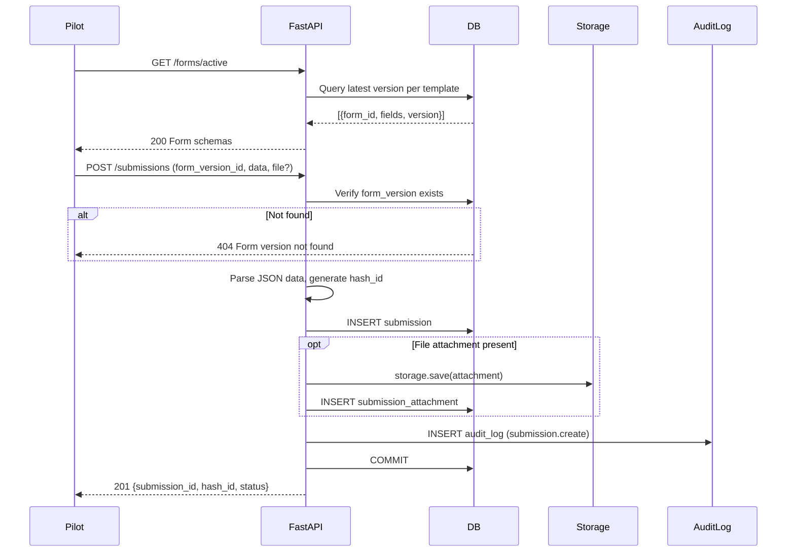
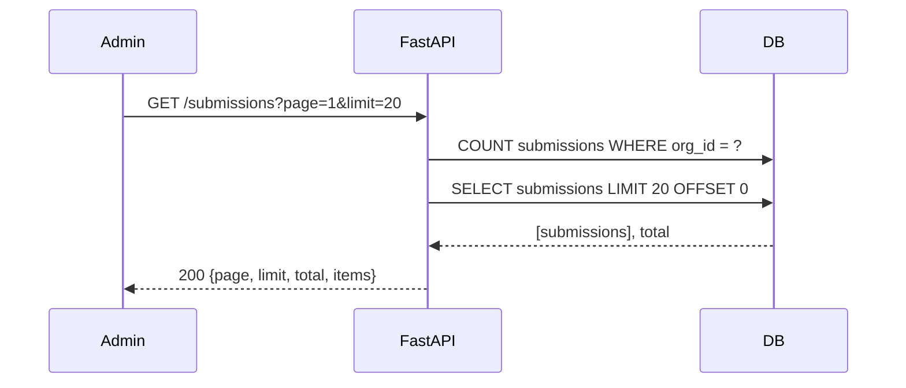
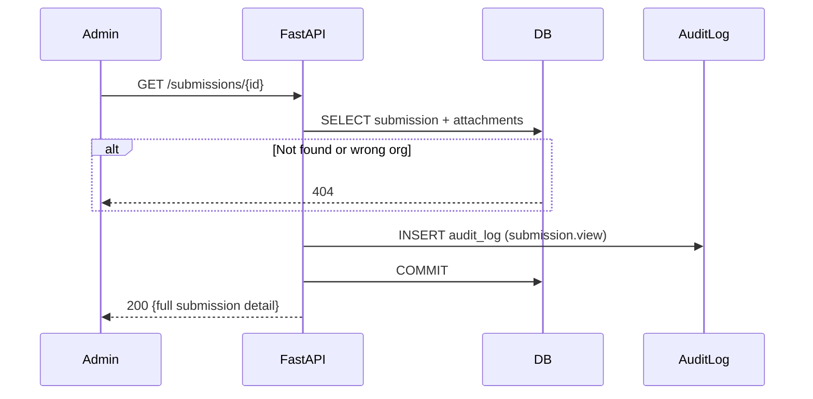

# Forms & Submissions — Architecture Document

> **Modules:** `app/api/v1/forms.py`, `app/api/v1/submissions.py`, `app/repositories/form_repo.py`, `app/repositories/submission_repo.py`
> **Version:** 1.0 — February 2026

---

## 1. Overview

The Forms & Submissions module implements digital aviation reporting. Pilots fill versioned form schemas and submit reports that are immutable once created. Admins and safety officers can list and review all submissions.

| Capability | Implementation |
|---|---|
| **Active Forms** | Returns the latest version of each form template for the user's org. |
| **Submit** | Pilot submits form data (JSON) with optional file attachment. Generates unique hash_id. |
| **List** | Paginated listing for admin/viewer roles. Scoped to user's org. |
| **View** | Single submission detail with attachments. Audit-logged. |

---

## 2. RBAC Matrix

| Endpoint | admin | chief_pilot | pilot | safety | planning | technical |
|---|---|---|---|---|---|---|
| `GET /forms/active` | Yes | Yes | Yes | Yes | Yes | Yes |
| `POST /submissions` | Yes | Yes | Yes | — | — | — |
| `GET /submissions` | Yes | Yes | — | Yes | Yes | Yes |
| `GET /submissions/{id}` | Yes | Yes | — | Yes | Yes | Yes |

---

## 3. Flow Diagrams

### Form Submission Flow

### Submission Listing Flow

### Submission Detail Flow

---

## 4. Data Dictionary

### `submissions` Table

| Column | Type | Description |
|---|---|---|
| `id` | `bigint PK` | Auto-generated identity |
| `org_id` | `bigint FK` | Owner organisation |
| `user_id` | `bigint FK` | Submitting pilot |
| `form_version_id` | `bigint FK` | Linked form version (immutable) |
| `data_json` | `jsonb` | Form field responses |
| `status` | `enum` | pending / submitted / delivered / failed |
| `hash_id` | `text UNIQUE` | Unique tracking identifier |
| `ip` | `varchar(45)` | Client IP at submission time |
| `device_info_json` | `jsonb` | Device metadata |
| `submitted_at` | `timestamptz` | Submission timestamp |
| `created_at` | `timestamptz` | Record creation |

### `form_versions` Table

| Column | Type | Description |
|---|---|---|
| `id` | `bigint PK` | Auto-generated identity |
| `template_id` | `bigint FK` | Parent form template |
| `version_number` | `int` | Monotonically increasing version |
| `schema_json` | `jsonb` | Field definitions (title, type, options) |
| `created_at` | `timestamptz` | Version creation |

---

## 5. Error Codes

| HTTP | When |
|---|---|
| 200 | List/view succeeded |
| 201 | Submission created |
| 400 | Invalid JSON in data field |
| 401 | Missing/invalid token |
| 403 | Role not permitted |
| 404 | Form version or submission not found |
