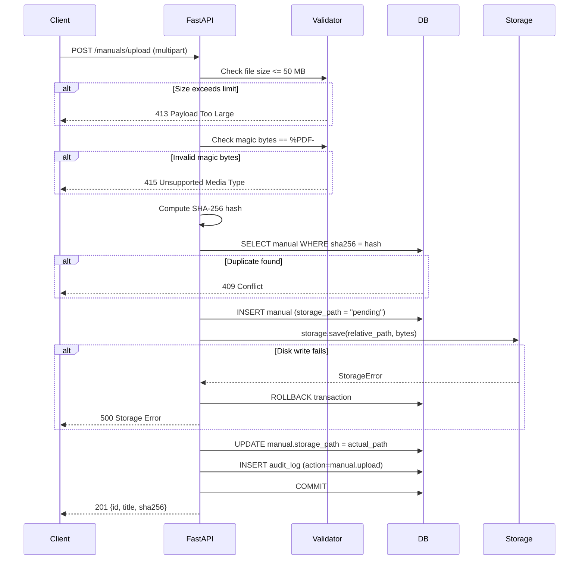
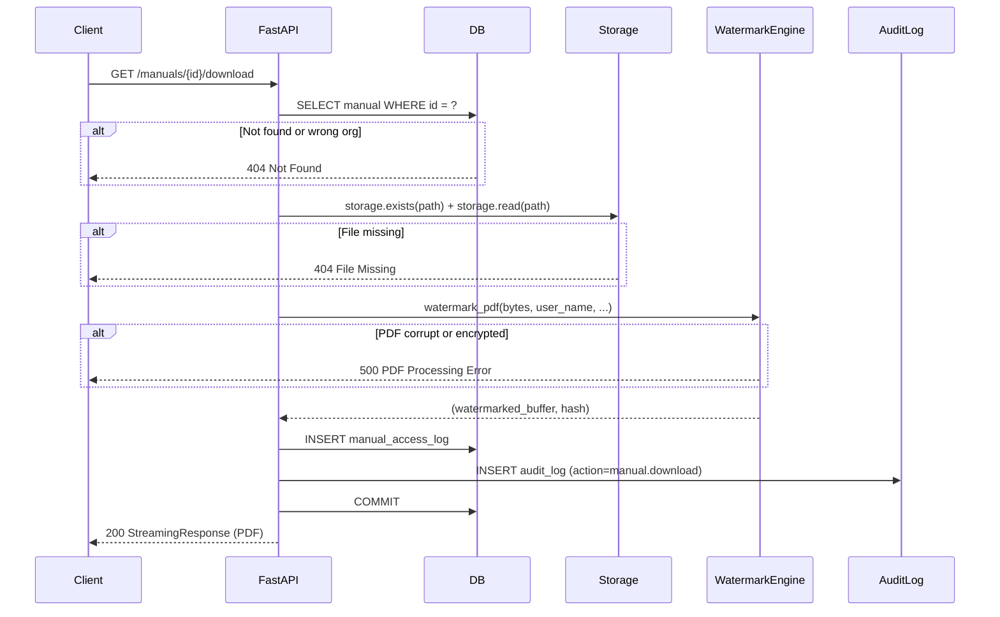
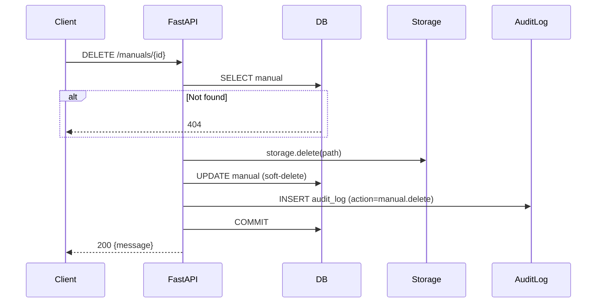
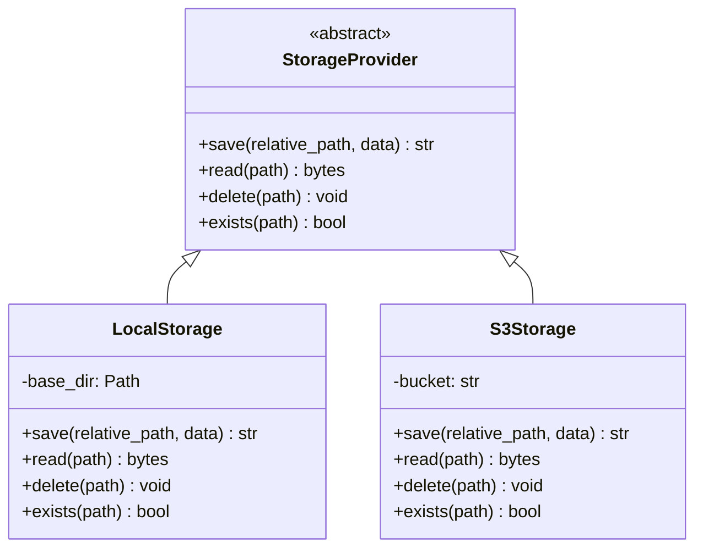

# Manual Library — Architecture Document (V2)

> **Module:** `app/api/v1/manuals.py`, `app/services/watermark_service.py`, `app/services/storage.py`, `app/repositories/manual_repo.py`
> **Version:** 2.0 — February 2026
> **Author:** SkyDeck Backend Team

---

## Table of Contents

1. [Overview](#1-overview)
2. [RBAC Matrix](#2-rbac-matrix)
3. [Endpoint Flow Diagrams](#3-endpoint-flow-diagrams)
4. [Upload — Transaction Rollback & Validation](#4-upload--transaction-rollback--validation)
5. [Storage Abstraction Layer](#5-storage-abstraction-layer)
6. [Watermarking Engine](#6-watermarking-engine)
7. [Audit Logging](#7-audit-logging)
8. [Data Dictionary](#8-data-dictionary)
9. [Error Codes](#9-error-codes)
10. [Security Considerations](#10-security-considerations)

---

## 1. Overview

The Manual Library provides secure PDF document management for aviation organisations. Every upload is validated with magic bytes, deduplicated by SHA-256, and saved through an abstracted storage layer. Every download is watermarked on-the-fly with forensic traceability information. Every action is audit-logged.

| Capability | Implementation |
|------------|---------------|
| **Upload** | Admin-only. Magic-byte (%PDF-) + size-limit (50 MB) validation. SHA-256 dedup. Transaction rollback on disk failure. |
| **List** | All authenticated users. Scoped to user's org. |
| **Download** | All authenticated users. Server-side watermark applied, graceful error handling for corrupt PDFs. |
| **Delete** | Admin-only. Soft-deletes DB record and removes physical file via StorageProvider. |
| **Audit** | Every upload, download, and delete is recorded in `audit_logs`. Downloads also go to `manual_access_logs`. |

---

## 2. RBAC Matrix

| Endpoint | admin | chief_pilot | pilot | safety | planning | technical |
|---|---|---|---|---|---|---|
| `POST /upload` | Yes | — | — | — | — | — |
| `DELETE /{id}` | Yes | — | — | — | — | — |
| `GET /` (list) | Yes | Yes | Yes | Yes | Yes | Yes |
| `GET /{id}/download` | Yes | Yes | Yes | Yes | Yes | Yes |

---

## 3. Endpoint Flow Diagrams

### Upload Flow (with Transaction Rollback & Magic Bytes)

### Download Flow (with Graceful PDF Error Handling)

### Delete Flow

---

## 4. Upload — Transaction Rollback & Validation

The upload follows a strict validation pipeline:

1. **Size gate** — reject files > `MAX_UPLOAD_SIZE_MB` (413)
2. **Magic bytes** — first 5 bytes must be `%PDF-` (415)
3. **SHA-256 dedup** — computed hash checked against DB (409)
4. **Filename sanitisation** — `secure_filename()` strips directory traversal
5. **DB INSERT** with `storage_path = "pending"` (not yet committed)
6. **Disk write** via `StorageProvider.save()`
7. On disk failure: **DB ROLLBACK** — no orphan record
8. On success: **UPDATE** `storage_path`, **INSERT** audit log, **COMMIT**

---

## 5. Storage Abstraction Layer

The `LocalStorage` class writes to `STORAGE_DIR` (default: `storage/manuals`). Path traversal is prevented by resolving the absolute path and verifying it stays within the base directory.

To migrate to S3/MinIO: implement `S3Storage(StorageProvider)` and swap the factory in `get_manual_storage()`.

---

## 6. Watermarking Engine

Uses `reportlab` for overlay generation and `pypdf` for merge. All in-memory.

The watermark contains:
- User's full name
- Timestamp (UTC)
- Unique hash ID (SHA-256 of user_id + manual_id + nonce + timestamp)
- "CONFIDENTIAL" notice

If the source PDF is corrupt, encrypted, or uses unsupported features, a `PDFProcessingError` (500) is raised with a descriptive message instead of an unhandled crash.

---

## 7. Audit Logging

Every manual action writes to `audit_logs`:

| Action | Trigger |
|---|---|
| `manual.upload` | Successful upload |
| `manual.delete` | Successful soft-delete |
| `manual.download` | Successful watermarked download |

Fields: `user_id`, `org_id`, `ip`, `target_type`, `target_id`, `metadata_json`, `created_at`.

Downloads additionally write to `manual_access_logs` with `watermark_hash_id`.

---

## 8. Data Dictionary

### `manuals` Table

| Column | Type | Description |
|---|---|---|
| `id` | `bigint PK` | Auto-generated identity |
| `org_id` | `bigint FK` | Owner organisation |
| `title` | `text` | Human-readable title |
| `storage_path` | `text` | Absolute disk path (or "pending" during upload) |
| `original_filename` | `text` | Sanitised original filename |
| `mime_type` | `text` | Always `application/pdf` |
| `file_size` | `bigint` | Bytes |
| `sha256` | `text UNIQUE` | Content hash for deduplication |
| `version_number` | `int` | Manual revision (default 1) |
| `uploaded_by` | `bigint FK` | User who uploaded |
| `is_active` | `bool` | False after soft-delete |
| `created_at` | `timestamptz` | Upload timestamp |
| `deleted_at` | `timestamptz` | Soft-delete timestamp |
| `last_accessed_at` | `timestamptz` | Last download timestamp |

---

## 9. Error Codes

| HTTP | Code | When |
|---|---|---|
| 201 | — | Upload succeeded |
| 200 | — | Download / delete succeeded |
| 400 | `bad_request` | Missing/invalid form fields |
| 401 | `unauthorized` | Missing/invalid token |
| 403 | `forbidden` | Role not permitted |
| 404 | `not_found` | Manual not found or file missing |
| 409 | `conflict` | SHA-256 hash collision (duplicate file) |
| 413 | `payload_too_large` | File exceeds MAX_UPLOAD_SIZE_MB |
| 415 | `unsupported_media` | Magic bytes check failed |
| 500 | `storage_error` | Disk write/read failure |
| 500 | `pdf_processing` | Watermark generation failure |

---

## 10. Security Considerations

1. **No MIME trust** — Content-Type header is ignored; magic bytes (`%PDF-`) are read from the actual file content.
2. **Path traversal** — `secure_filename()` strips `../`, `\`, non-ASCII, and normalises names.
3. **Storage isolation** — `LocalStorage._resolve()` verifies the resolved path stays within `base_dir`.
4. **Size limit** — 50 MB default prevents disk exhaustion DoS.
5. **Deduplication** — SHA-256 prevents storage waste and detects re-uploads.
6. **Audit immutability** — `audit_logs` is append-only.
7. **Watermark traceability** — Every downloaded copy contains a unique hash linking back to the user and timestamp.
8. **Transaction safety** — DB rollback on disk failure prevents orphan records.
